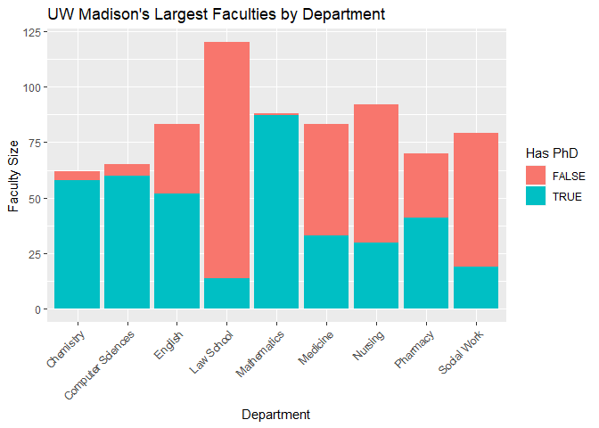

Homework 1
================
Robert George
9/15/2021

``` r
library(rvest)
library(tidyverse)
```

    ## -- Attaching packages --------------------------------------- tidyverse 1.3.1 --

    ## v ggplot2 3.3.5     v purrr   0.3.4
    ## v tibble  3.1.4     v dplyr   1.0.7
    ## v tidyr   1.1.3     v stringr 1.4.0
    ## v readr   2.0.1     v forcats 0.5.1

    ## -- Conflicts ------------------------------------------ tidyverse_conflicts() --
    ## x dplyr::filter()         masks stats::filter()
    ## x readr::guess_encoding() masks rvest::guess_encoding()
    ## x dplyr::lag()            masks stats::lag()

``` r
library(xml2)
library(ggplot2)

#read in the website
html = read_html("https://guide.wisc.edu/faculty/")%>%
  html_nodes(".uw-people")

#initialize an empty dataframe
empty = data.frame(name = "",
                   position = "",
                   department = "",
                   degree = "")

#iterate through letters of the alphabet
for (i in 1:26){
  a_html = html[i]%>%
    html_nodes("p")
  a = as_list(a_html)
  #iterate through entries within letter
  for (j in 1:length(a)){
    b = unlist(a[j])
    #drop entries missing an element
    if(length(b) == 4){
      df = as_data_frame(b)
      df["col"] = c("name", "position", "department", "degree")
      df = pivot_wider(df, values_from = value, names_from = col)
      empty = rbind(empty, df)
    }
  }
}
```

    ## Warning: `as_data_frame()` was deprecated in tibble 2.0.0.
    ## Please use `as_tibble()` instead.
    ## The signature and semantics have changed, see `?as_tibble`.
    ## This warning is displayed once every 8 hours.
    ## Call `lifecycle::last_warnings()` to see where this warning was generated.

``` r
#resulting dataset drops first empty row
result = empty[-1,]
rownames(result) = NULL
head(result)
```

    ##                   name              position              department
    ## 1      ABBOTT,DAVID H.             Professor Obstetrics & Gynecology
    ## 2   ABD-ELSAYED,ALAA A Assoc Professor (Chs)          Anesthesiology
    ## 3     ABDUALLAH,FAISAL             Professor                     Art
    ## 4 ABRAHAM,OLUFUNMILOLA   Assistant Professor                Pharmacy
    ## 5      ABRAMS,SAMANTHA        Assoc Lecturer      Information School
    ## 6         ABRAMSON,LYN             Professor              Psychology
    ##                                degree
    ## 1    PHD 1979 University of Edinburgh
    ## 2        MD 2000 University of Assiut
    ## 3       PHD 2012 Royal College of Art
    ## 4  PHD 2013 Univ of Wisconsin-Madison
    ## 5   MA 2017 Univ of Wisconsin-Madison
    ## 6 PHD 1978 University of Pennsylvania

``` r
library(stringr)
freq_tbl = result%>%
  group_by(department)%>%
  mutate("faculty size" = n())%>%
  filter(`faculty size` > 60)%>%
  select(-`faculty size`)%>%
  mutate('Has PhD' = str_detect(degree, "PHD"))
head(freq_tbl)
```

    ## # A tibble: 6 x 5
    ## # Groups:   department [6]
    ##   name                   position            department        degree  `Has PhD`
    ##   <chr>                  <chr>               <chr>             <chr>   <lgl>    
    ## 1 ABRAHAM,OLUFUNMILOLA   Assistant Professor Pharmacy          PHD 20~ TRUE     
    ## 2 ADAMS,AERON            Clinical Asst Prof  Nursing           DNP 20~ FALSE    
    ## 3 AHRENS,SARAH ELIZABETH Clinical Assoc Prof Medicine          MD 200~ FALSE    
    ## 4 AI,ALBERT L            Visiting Asst Prof  Mathematics       PHD 20~ TRUE     
    ## 5 AIKEN,JEFFREY P        Adjunct Instructor  Law School        JD 197~ FALSE    
    ## 6 AKELLA,ADITYA          Professor           Computer Sciences PHD 20~ TRUE

``` r
ggplot(data = freq_tbl)+
  geom_bar(aes(x = department, fill = `Has PhD`))+
  theme(axis.text.x = element_text(angle = 45, hjust = 1))+
  xlab("Department")+
  ylab("Faculty Size")+
  ggtitle("UW Madison's Largest Faculties by Department")
```

<!-- -->
